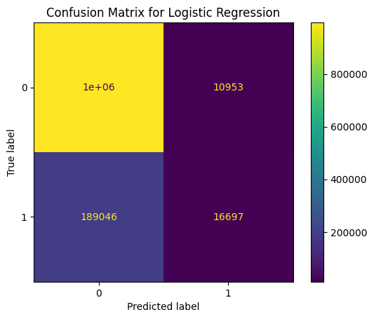
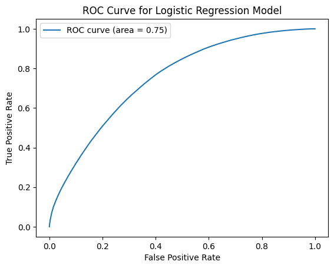
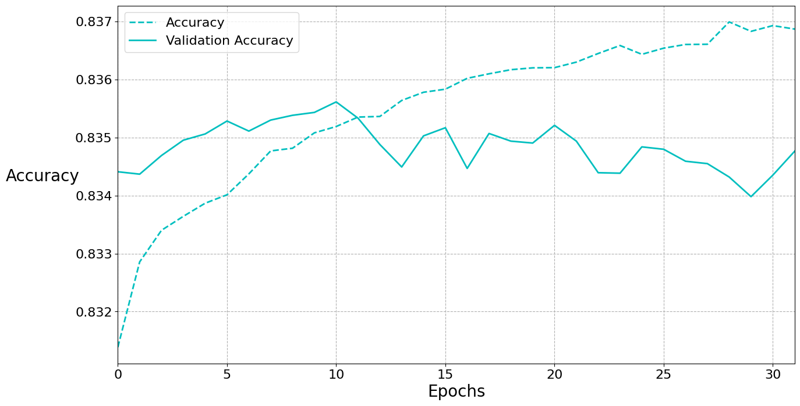

# Predict whether an online advertisement will be clicked

*Girish Natarajan*

### Executive summary
#### Project Objective 
The objective of this work is to evaluate whether we can accurately predict clicks on online advertisements. Towards this objective, the Avazu dataset from Kaggle was used to develop a system that accurately predicts the click-through rate (CTR). This information is essential to maximize the effectiveness of your advertising campaigns.
#### Methodology:

##### Data: 

10 days of real-world data from the Avazu dataset was utilized. The data included attributes such as the characteristics of the app, features of the advertising site, and details about the user's mobile device.

##### Algorithms:

Several machine learning algorithms were rigorously tested, including:
* Logistic Regression
* Decision Trees
* Neural Networks

##### Key Findings:

* **Neural Networks Outperform:** Neural networks delivered the highest accuracy in predicting click-through rates, with an accuracy of 83.55%.

##### Next Steps:

* _Hyperparameter Tuning:_ The neural network model can be fine tuned. This involves adjusting parameters to further improve accuracy and optimize ad targeting.
* _Additional Data:_ Incorporating more data across multiple weeks can potentially further increase the model's accuracy and adaptability.

#### Benefits to You

* _Enhanced Campaign Performance:_ The refined CTR prediction system will help you pinpoint the ads most likely to generate clicks, leading to more effective campaigns.
* _Data-Driven Decisions:_ The project findings provide valuable insights into user behavior, allowing for informed, data-driven ad placement.
* _Cost Savings:_ Maximize your ad spending by focusing on high-potential ads, reducing wasted investment.
  
These next steps will deliver an even more robust system, helping you significantly enhance your online ad campaigns.

### Rationale
In today's digital age, online advertising reigns supreme. Its effectiveness hinges on understanding user behavior and predicting their actions. This is where click-through rate (CTR), the probability of a user clicking on an ad, becomes crucial. Accurately predicting CTR empowers advertisers to optimize campaigns, maximize reach, and deliver targeted messaging. The result would be higher profit for websites, and a better user experience for the user. This balance is very important for the sustenance of the free and open internet.

### Research Question
Given a user and the characteristics of a website that they are browsing, determine how likely it is that they will click on an advertisement that they are shown.

### Data Sources
The datasets conidered for this project were available as part of contests in Kaggle. The two datasets that seemed like a good fit were:
* A week worth of data from Criteo Labs, as part of their [Display Advertising Challenge](https://www.kaggle.com/competitions/criteo-display-ad-challenge).
* 11 days worth of data from mobile ads company Avazu as part of their [Click-Through Rate Prediction Challenge](https://www.kaggle.com/competitions/avazu-ctr-prediction/overview)

Of these, the [dataset](https://www.kaggle.com/competitions/avazu-ctr-prediction/overview) from Avazu was chosen for the exercise.

### Methodology
CRISP-DM was leveraged as the structured framework for problem solving. As part of the project, extensive data analysis, understanding and feature engineering were performed. For model training, classification algorithms such as Logistic Regression, KNN, Decision Trees and Support Vector Machines were leveraged. Techniques also involved hyper parameter tuning, and model selection based on performance objectives.

### Results
A major learning was that with high dimensionality (~10K features after one-hot encoding), and large size of dataset (~4MM at 10% sampling), the capablities of a normal runtime was exceeded. For this exercise, GridSearch of various hyperparameters was conducted on 4 models - `LogisticRegression`, `DecisionTreeClassifier`, `KNearestNeighborClassifier` and `SVC`. In addition, a simple `Nueral Network` with a depth of 2 was trained.

Based on the training runs that could be completed, `LogisticRegression` with a `max_iter=10000` yielded the best accuracy of `0.835` among the machine learning algorithms. The log loss for this model was `0.397`. The ROC Curve and Confusion Matrix were also analyzed prior to picking `LogisticRegression` as the best among the traditional models. 

However, even a rudimentary Neural Network delivered an accuracy of `0.8355` and shows great potential. With this finding, Neural Networks are being recommended as the winning method for this project, with a recommendation to train deeper networks.

#### Logistic Regression

#### Neural Network

### Next steps
Both `Logistic Regression` and `Neural Network` shows promise for this exercise. The next steps recommended are to try Ensemble Models and more complex Neural Networks to increase the accuracy. Since the dataset has high dimensionality and size, GPU based training would be required for efficient exploration.

With traditional models, exploration of ensemble techniques using GPU based library such as `cuML` is proposed. In addition, Neural Networks naturally lend themselves to GPU based training, and should be explored further.

#### Outline of project

- [Notebook 1: Data understanding](1-click-through-prediction-data-understanding.ipynb)
- [Notebook 2: Data Preparation](2-click-through-prediction-data-preparation.ipynb)
- [Notebook 3: Model Training](3-click-through-prediction-modeling)
