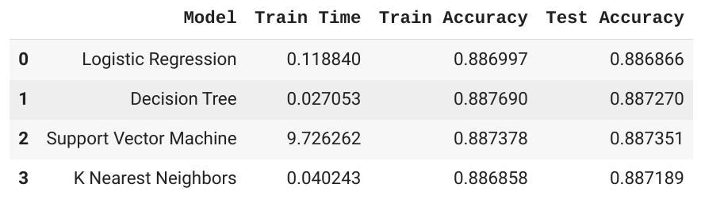
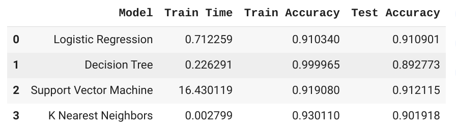
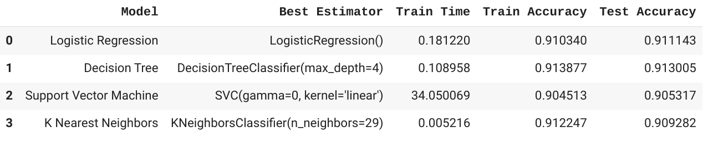
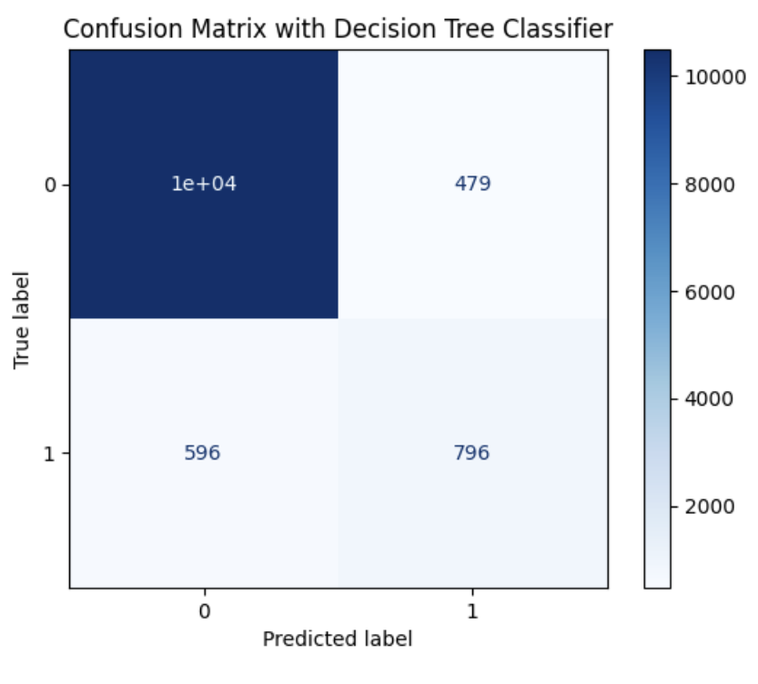
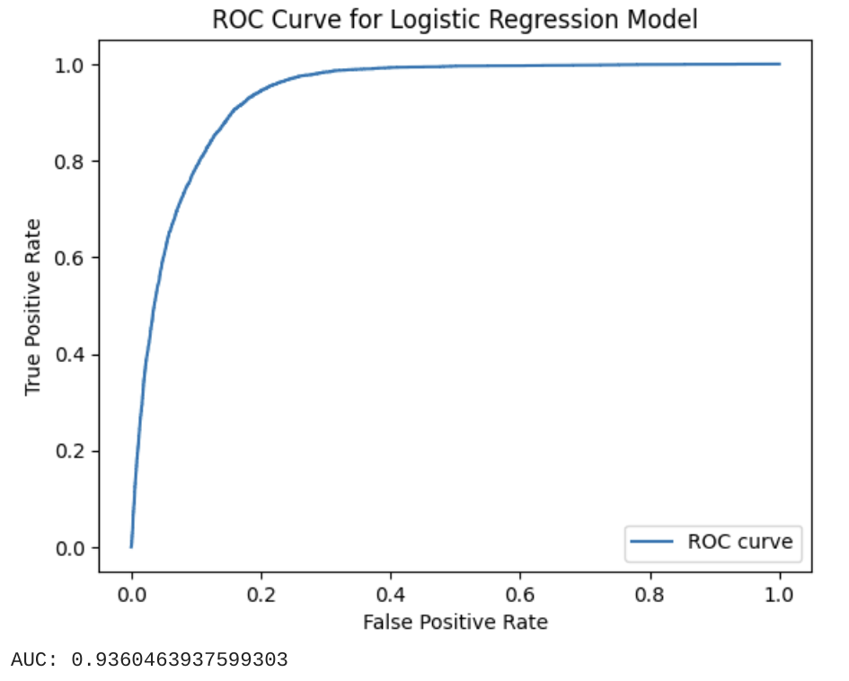

# Comparing Classifiers

In this practical application exercise, the performance of 4 classifiers were compared. The classifiers were Logistic Regression, Support Vector Machine, K Nearest Neighbors, and Decision Trees.

The [dataset](data/bank-additional-full.csv) is from a Porugese bank's marketing efforts. The first step was to comprehend and analyze the [article](data/CRISP-DM-BANK.pdf) that summarizes the original study.

The entire analysis and code is in the [Jupyter Notebook](comparing-classifiers.ipynb)

## Business Objective

The business objective is to improve the effectiveness of the bank's marketing efforts, thereby reducing human and technology costs. The effectiveness of a marketing campaign may be defined as the percentage of customers who start a term deposit as a result of the campaign. To achieve said effectiveness, we would want to build a model that can classify customers based on their probability to convert.

## Baseline

The accuracy score of the baseline was determined to be 88.7.

## Data Undestanding & Feature Engineering

The dataset maybe divided into features under various categories, namely:
* Bank Client Data
* Related to Last Contact of current campaign
* Campaign outcome
* Socio Economic features

Feature engineering was focused on the Bank Client Data. The following transformations were performed:
* Age was binned into a categorical value
* Job and Marital were simplified to be binary values `is_employed` and `is_married`
* Education and Default features were dropped
* Unknowns across all columns were mapped to No

After running initial models on the Bank Client Data, all the other features were added in, using `OneHotEncoder` for categorical features 'age_cat', 'contact', 'month', 'day_of_week', 'poutcome' and `StandardScaler` for all numeric features.

## Classifiers and Results

The initial effort to use only the Bank Client Data (5 features after feature selection) yielded only marginal improvements above the baseline. Default parameters were used for each of the classifier involved. This iteration was not sufficient to improve the efficiency of marketing efforts.

The second iteration was to include other features from the categories Last Contact, Campaign Outcome and Socio Economic. The original feature transformations done on the Bank Client data was retained. With default parameters for each classifier, the results improved dramatically in this iteration. `Logistic Regression` and `Support Vector Machine` produced 30% improvement at 91% train/test accuracy representing a 2.8% improvement over the baseline. Logistic Regression was superior in this iteration, since Support Vector Machine required significantly more computing resources and time to produce the same results.

The final iteration involved using `GridSearchCV` to improve the results. After Grid Search, all classifiers demonstrated 3% improvement over the baseline with `DecisionTreeClassifier` producing the best performance across accuracy and time taken.

Overall, with this effort it was decided that using a Decision Tree of Max Depth 4, a 3% improvement in efficiency could be delivered to the bank with 91.3% accuracy.

### Analyzing the Performance and using other Performance measures

To analyze the performance of these winning classifiers with respect to other performance measures, tools like Confusion Matrix and ROC-AUC analysis was leveraged. Based on this, it was determined that:
* Decision Tree provided the best accuracy at 91.3%
* Logistic Regression produced a higher AUC at 93%

