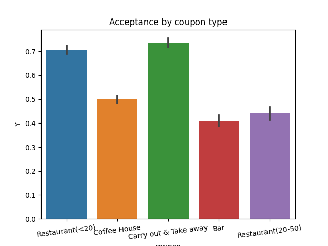

# Will the Customer Accept the Coupon?

This analysis was performed on a [dataset](data/coupons.csv) from the UCI Machine learning repository. The exploratory analysis, findings and next steps are available in a [Jupyter Notebook](customer-coupon-investigation.ipynb).

## General Findings

The overall acceptance rate of coupons is around 57%. The data can be sliced as below.

## Analysis of Bar Coupons

The guided part of the analysis revolved around Bar coupons. The acceptance rate of Bar coupons is 41%. 

The data was then sliced to arrive at the following findings:
*   Acceptance rate among drivers who go to the bar more than once a month, do not have kid passengers and are not widowed was 71%
*   Acceptance rate among drivers who go to the bar more than once a month and are aged less than 30 was 64%
*   Acceptance rate among drivers who go to cheap restaurants and have income less than 50K was 59%
*   Acceptance among drivers who fall into any of these criteria was 66%.

Based on this analysis, it can be hypothesised that that drivers of a younger age who already go to the bar more than once a month are more likely to accept the coupons. It can also be noticed that drivers who tend to go to the bar more often (e.g. greater than 3 times) are more likely to accept the coupon. Another hypothesis is that having kids in the car is a strong deterrent for coupon acceptance.

Using these filters, the acceptance rate of Bar coupons could be increased from 41% to 66%

## Findings from exploratory analysis of user, context and coupon attributes

By plotting the relationship between various user, context and coupon attributes against acceptance rates, a lot of findings could be derived.

**User attributes**
*   Male drivers accept Bar coupons more than female drivers
*   Drivers below 21 have an affinity for coffee house coupons
*   Bar coupon acceptance rates are higher among drivers < 30 years old
*   Coupons for expensive restaurants are likely to be accepted by drivers living with partners.
*   Drivers who have no children are more likely to accept Bar coupons
*   Drivers that are divorced or widowed are less likely to accept restaurant coupons

**Context attributes**
*   For bar coupons, the passenger attribute has a big impact. Having kid(s) in the vehicle is a big deterrent, but having Friend(s) in the vehicle increases the probability of acceptance.
*   For bars and all restaurants, the coupon tends to perform worse when the temperature is below 55
*   Sunny weather increases acceptance of restaurant coupons
*   Lower price restaurant and coffee house coupons are accepted more when the driver is heading to no place urgent
*   Drivers do not accept Coffee house coupons very often if they are heading home.
*   Probability of a driver accepting a coupon is lower after 10PM. The only exception is Bar coupons.
*   Restaurants, both cheap and high end, tend to have higher acceptance between 10AM and 6PM.
*   A driver is more likely to accept a higher end restaurant coupon, if they are driving with a Partner.

**Coupon attributes**
*   Coupons with 1d expiry tend to work better for both cheap and expensive restaurants. This applies to a smaller extent for Coffee houses and carry out. Bars are unimpacted by coupon expiration.

## Findings specific to Restaurant(<20) coupons

Based on the exploratory analysis, the following attributes were identified as more impactful to Restaurant(<20) coupon acceptance:
*   Weather is sunny
*   Temperature is above 55
*   Time is between 10AM and 6PM
*   Coupon validity is 1d
*   Destination is No Urgent Place
*   Not divorced or widowed

General acceptance rate of Restaurant(<20) coupons is 70.7%. Applying the above conditions, higher percentages could be attained.
*   Weather is sunny - 77%
*   Temperature is above 55 - 75%
*   Time is between 10AM and 6PM - 80%
*   Coupon validity is 1d - 83%
*   Destination is No Urgent Place - 79%
*   Not divorced or widowed - 71%

Combining all of the above conditions yielded a 91% acceptance rate, confirming that these attributes are indeed correlated with coupon acceptance.

## Next Steps

As a further iteration, we may be able to add more factors like occupation and direction of travel to improve the acceptance rate even further for restaurant coupons. It would also be interesting to see if the results for Restaurants(<20) are applicable to more expensive Restaurants also.

Separately, there seem to be some interesting trends for Coffee Houses that can be explored in a similar analysis.

